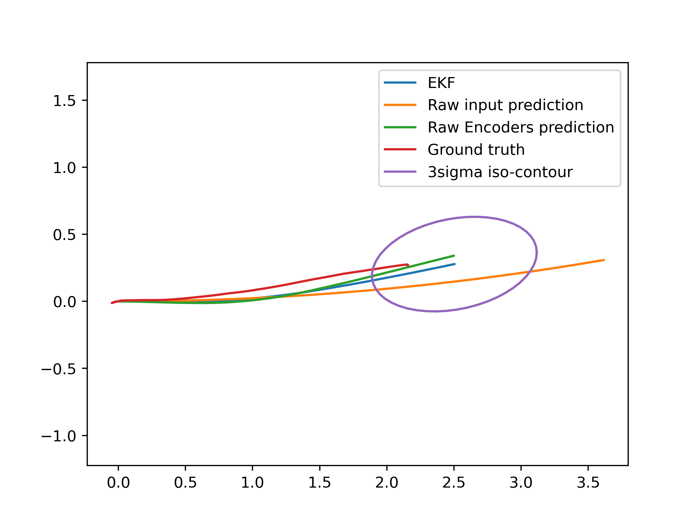

# Perception in Robotics 2022 final project. Akula odometry

Skoltech educational project. Performed within the [Perception in Robotics 2022](https://github.com/SkoltechAI/Perception-in-Robotics-course-T3-2022-Skoltech) coursework at Skoltech.


## Requirements

* Python >= 3.6
* also install all required libraries with command `pip3 install -r requirements.txt`


## Usage

* first of all, you need to compute ground truth path using lidar data. For that we used [this](https://github.com/laboshinl/loam_velodyne) repository.


* then, you can use collected data from sensors and try to reconstruct poses of robot using the Kalman Filer. (You should to be in `.../perception22-akula/` directory)

```bash
python3 sync.py -src_obs ./data/obs07.txt -src_act ./raw_data/input_log07.txt -save_to ./output
````

<p align="center">
  
</p>
